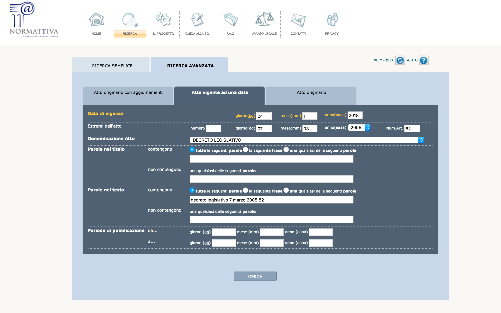
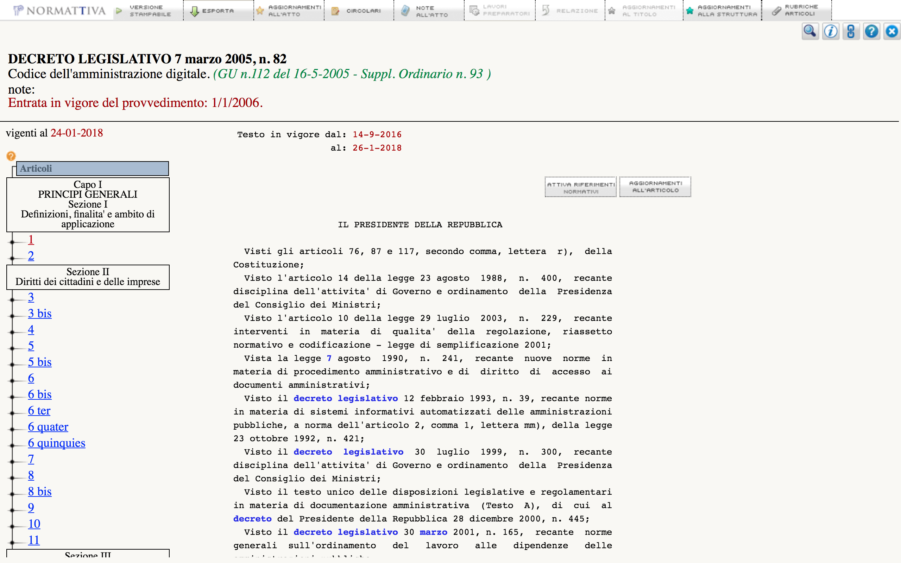

Creazione dei testi di input da Normattiva
==========================================

Come primo passo, è necessario ottenere i testi del CAD da `Normattiva <http://www.normattiva.it>`_.
Gli strumenti di ricerca del sito permettono di ottenere le versioni di una determinata legge in vigore in una data specifica. La :numref:`Figura %s <fig1>` mostra il motore di ricerca avanzato di Normattiva. Selezionando la **Data di vigenza** opportuna, è possibile ottenere le diverse versioni del CAD nel corso della sua storia. Normattiva permette di selezionare date nel futuro, qualora una nuova versione di una legge sia stata approvata ma non ancora entrata in vigore. 

.. _fig1:

   Il motore di ricerca avanzato di Normattiva.

   

Il procedimento è laborioso, perché non esiste una funzione API che permetta un accesso programmatico a tutto il testo di un documento legislativo. Una volta trovata la versione richiesta di una legge, è possibile visualizzarne il testo completo tramite il pulsante **Versione stampabile** in alto a sinistra. La :numref:`Figura %s <fig2>` mostra il testo del CAD in vigore il 24 gennaio 2018. 

.. _fig2:

   Il testo del CAD come visualizzato su Normattiva. 

Tutte le versioni del CAD ottenute da Normattiva.it sono contenute nella cartella `input` in `questo repo <https://github.com/italia/cad-docs/tree/master/conversione-cad>`_.
